# base16 theme for Factor listener

- clone the repo:

    git clone "https://github.com/inivekin/base16-factor.git base16-theme

- mv the base16-theme folder into the work directory of your factor file tree.

- change line 9 in base16-theme.factor to be the theme you want

- make sure the following is in your ~/.factor-rc

    USING: ui.theme.switching base16-theme ;
    base16-theme switch-theme

# examples

## google

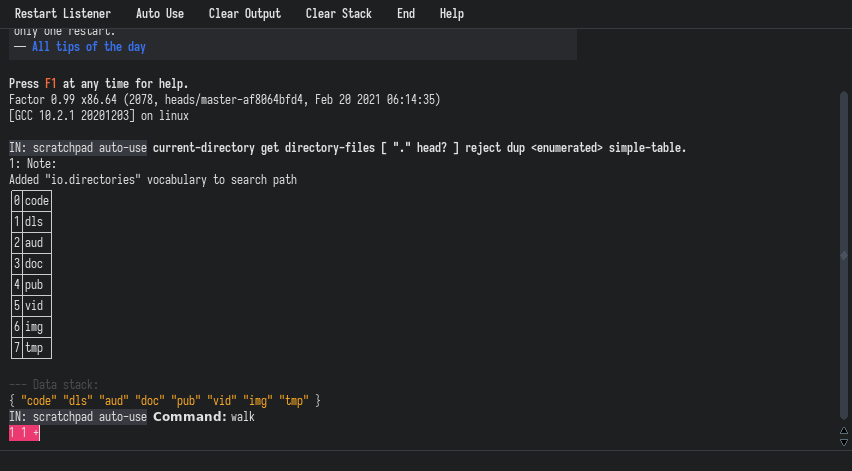

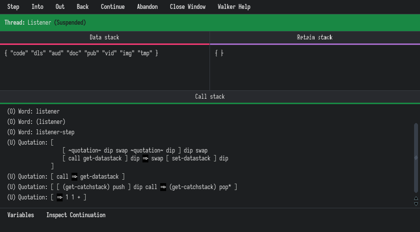

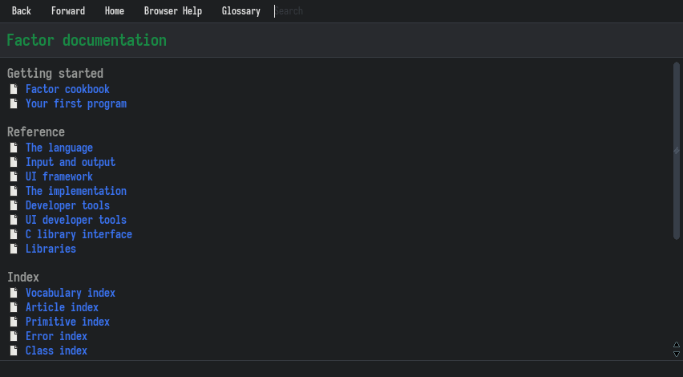

## monokai

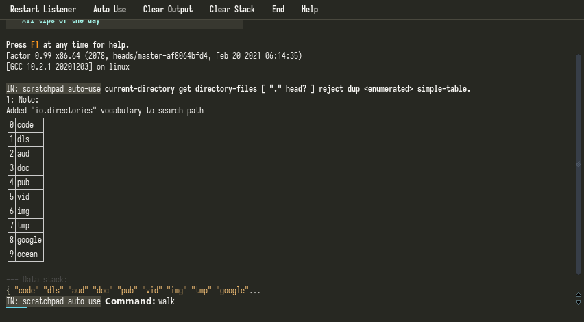

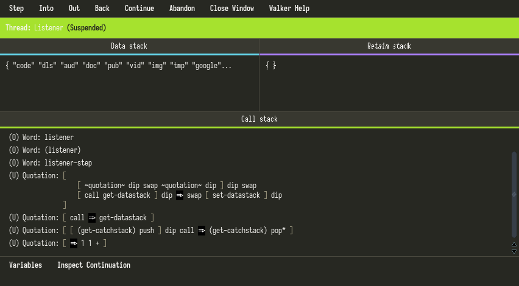

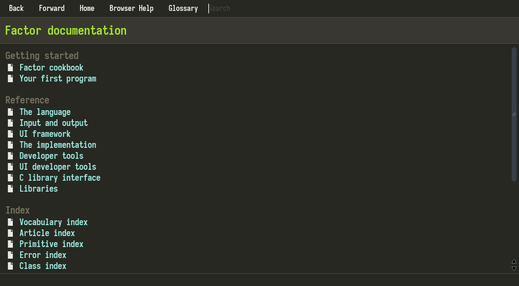

## ocean

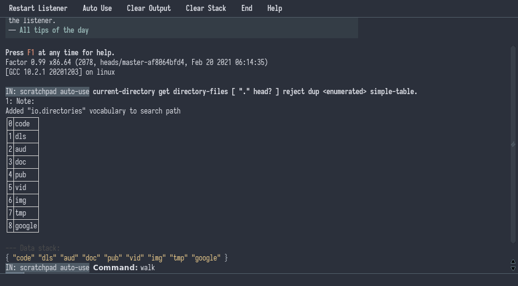

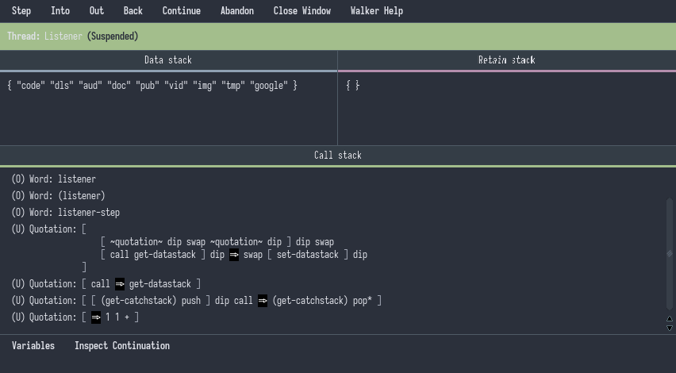

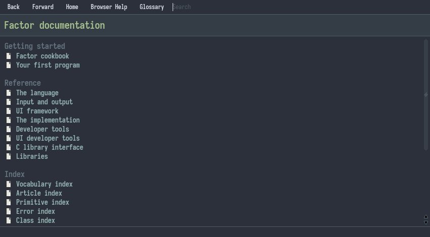

## greenscreen

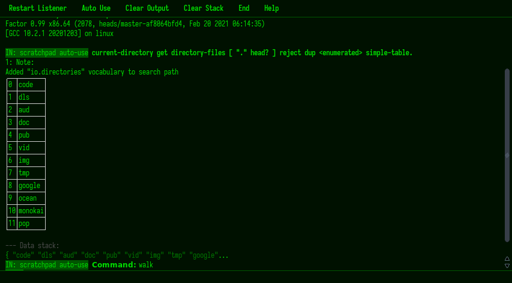

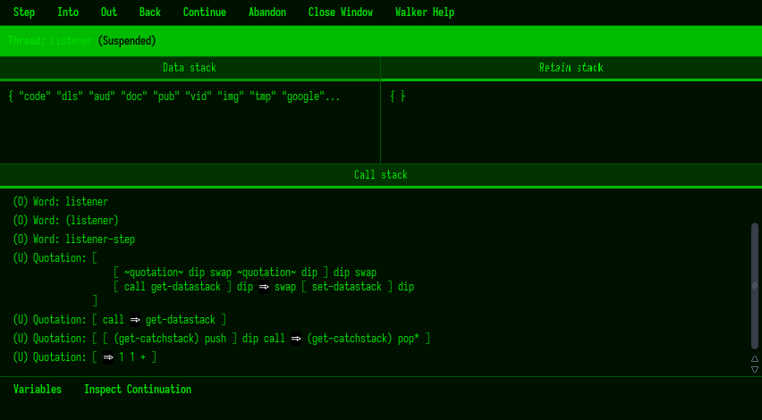

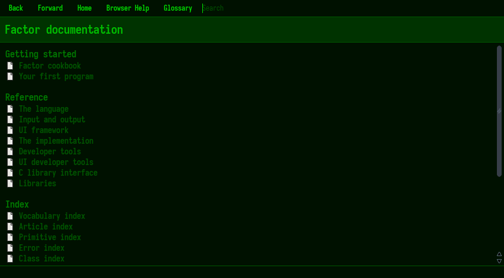

## pop

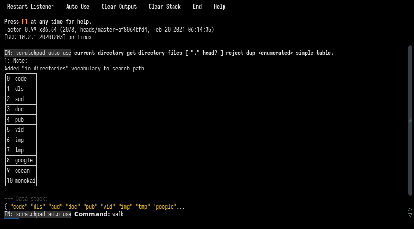

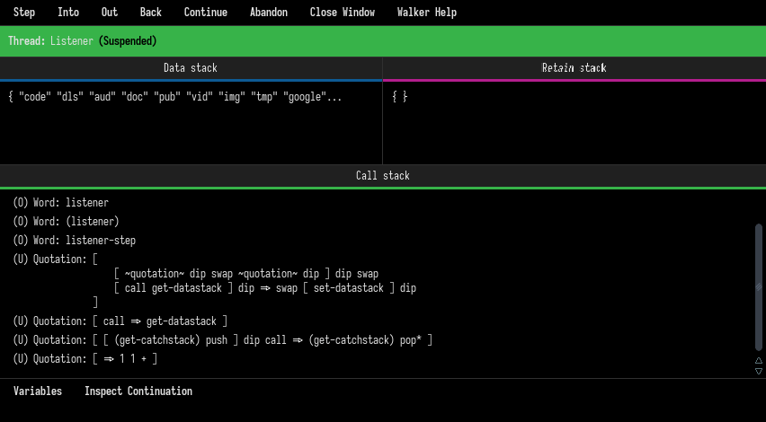

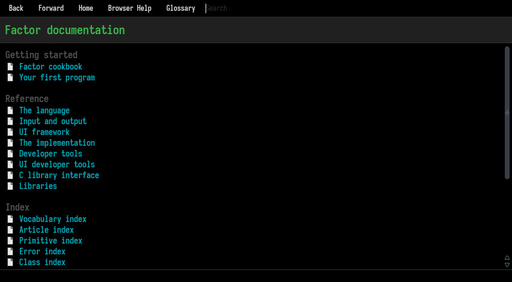

